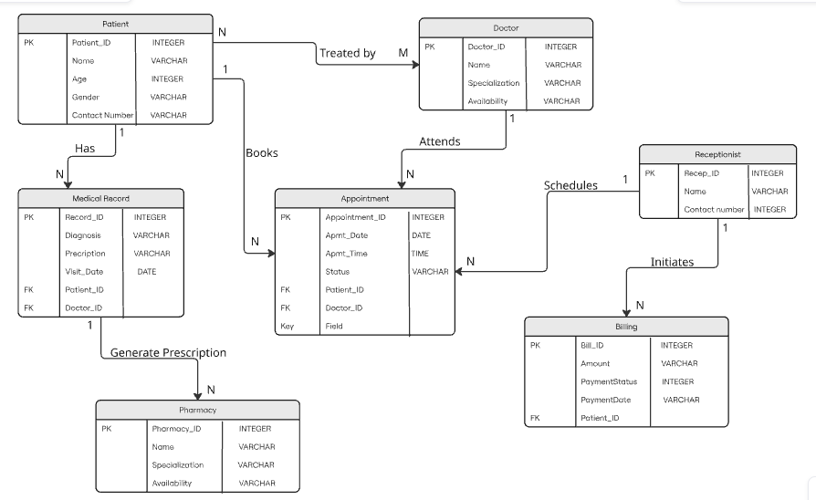

# Healthify - Hospital Management System

## Table of Contents

- [Project Overview](#project-overview)
- [Problem Statement](#problem-statement)
- [Target Users](#target-users)
- [Key Features](#key-features)
- [Software Design](#software-design)
  - [System Architecture](#system-architecture)
  - [Context Diagram](#context-diagram)
  - [Class Analysis Diagram](#class-analysis-diagram)
  - [Entity Relationship Diagram](#entity-relationship-diagram)
  - [Activity Diagram](#activity-diagram)
- [Branching Strategy](#branching-strategy)
- [Success Metrics](#success-metrics)
- [Assumptions and Constraints](#assumptions-and-constraints)

---

## Project Overview

Healthify is a centralized, web-based application designed to manage hospital operations efficiently. It integrates patient registration, appointment scheduling, medical records, billing, and pharmacy coordination into a single platform, reducing manual work and improving communication among hospital stakeholders.

---

## Problem Statement

Many hospitals rely on manual or fragmented systems for handling appointments, patient data, billing, and prescriptions. This results in appointment conflicts, long waiting times, data inconsistencies, and increased administrative workload. The lack of a unified system negatively impacts both hospital staff productivity and patient experience.

---

## Target Users

| Role | Responsibilities |
|---|---|
| **Patient** | Books appointments, views medical records, prescriptions, and billing details. Receives notifications. |
| **Doctor** | Views daily appointments and patient history. Records diagnosis and prescriptions. Manages consultation workflow. |
| **Receptionist** | Registers patients and schedules appointments. Manages appointment queues. Initiates billing processes. |
| **Pharmacy Staff** | Receives digital prescriptions. Manages medicine inventory. Dispenses medicines to patients. |

---

## Key Features

- Role-based access control for all four user types
- Online appointment booking and scheduling with availability checks
- Digital storage of patient medical records and consultation history
- Integrated billing and payment tracking
- Prescription management and pharmacy coordination
- Secure handling of sensitive healthcare data

---

## Software Design

Healthify follows a layered architecture separating the presentation, application, service, and data access concerns. The system is designed around four core actors (Patient, Doctor, Receptionist, Pharmacy Staff) each with strictly scoped roles, ensuring data security and clear workflow ownership. A modular service layer keeps billing, clinical, and pharmacy operations independent, allowing each to evolve without affecting the others.

---

> **Design choices:** The system is structured into five layers: Presentation (role-specific dashboards with RBAC), Application Modules (Registration, Appointment, Consultation, Billing, Pharmacy, Notification), Service Layer (Patient, Clinical, Admin, Pharmacy services), Data Access Layer (DAOs per entity), and the Relational Database. This separation ensures each concern is independently maintainable and testable. Role-Based Access Control is enforced at the presentation layer so that no user can access functionality outside their assigned role.

---

### Context Diagram

The context diagram establishes the system boundary and shows all data flows between the Hospital Management System and its four external actors. It confirms what data enters and leaves the system from each role.

**Key data flows:**

| Actor | Into System | Out of System |
|---|---|---|
| Patient | Appointment Request, Login Credentials | Appointment Confirmation, Medical Records, Billing Information |
| Receptionist | Patient Registration Data, Appointment Scheduling Data, Billing Initiation | Appointment List, Patient Details, Billing Status |
| Doctor | Diagnosis Details, Prescription Data, Consultation Status | Patient Information, Appointment Schedule |
| Pharmacy | Medicine Dispensed Status, Inventory Update | Prescription Details, Patient Information |

---

### Class Analysis Diagram

The class diagram defines the core domain model of Healthify. It captures the eight primary classes, their attributes, operations, and the associations and multiplicities between them.

**Core classes and responsibilities:**

| Class | Key Attributes | Key Operations |
|---|---|---|
| `Patient` | PatientID, Name, Age, Gender, ContactNumber | viewAppointment(), viewMedicalRecords(), viewBills() |
| `Doctor` | DoctorID, Specialization, Name, ContactNumber | viewAppointments(), createMedicalRecord() |
| `Receptionist` | EmpID, Name, DeskNum | registerPatient(), scheduleAppointment(), generateBill() |
| `Appointment` | appointmentID, date, time, status | schedule(), cancel() |
| `Medical Record` | recordID, visitDate, diagnosis | updateDiagnosis() |
| `Prescription` | prescriptionID, dosage, duration | addMedicine(), removeMedicine() |
| `Billing` | billID, amount, paymentStatus | generateBill() |
| `Pharmacy Staff` | EmpID, Name, address, contactNumber | viewPrescriptions(), updateStock() |

**Key relationships:**

- A Patient has zero to many Appointments and zero to many Medical Records (1 to N)
- A Doctor attends zero to many Appointments and creates Medical Records (1 to N)
- A Receptionist schedules Appointments and generates Bills
- A Medical Record generates zero to many Prescriptions (1 to N)
- A Patient has zero to many Bills (1 to N)

---

### Entity Relationship Diagram

The ER diagram maps the relational database structure underlying Healthify. It defines all entities, primary keys, foreign keys, and the cardinality of each relationship as it will be implemented in the database.

**Entity summary:**

| Entity | Primary Key | Notable Foreign Keys |
|---|---|---|
| Patient | Patient_ID | - |
| Doctor | Doctor_ID | - |
| Appointment | Appointment_ID | Patient_ID, Doctor_ID |
| Medical Record | Record_ID | Patient_ID, Doctor_ID |
| Billing | Bill_ID | Patient_ID |
| Pharmacy | Pharmacy_ID | - |
| Receptionist | Recep_ID | - |

**Relationship cardinalities:**

- Patient to Doctor: N to M via Appointment (Treated by)
- Patient to Medical Record: 1 to N (Has)
- Patient to Appointment: 1 to N (Books)
- Doctor to Appointment: 1 to N (Attends)
- Receptionist to Appointment: 1 to N (Schedules)
- Receptionist to Billing: 1 to N (Initiates)
- Medical Record to Pharmacy: 1 to N (Generate Prescription)

---

### Activity Diagram

The activity diagram models the end-to-end workflow of a patient visit across all five swim lanes: Patient, Receptionist, Hospital System, Doctor, and Pharmacy. It captures the main flow, the alternative slot suggestion on unavailability, and the parallel consultation-billing-pharmacy processes.

**Flow summary:**

1. Patient logs in and requests an appointment
2. Receptionist registers or retrieves the patient record
3. System validates data and checks doctor availability
4. If unavailable: system suggests an alternative slot and informs the patient to reschedule
5. If available: doctor is notified and accesses patient medical history
6. Patient waits for consultation; doctor consults, enters diagnosis, and prescribes medication
7. System triggers the billing process in parallel
8. Pharmacy receives prescription request, prepares medicine, and notifies the patient to collect
9. Patient collects medicine and the workflow ends

---

## Branching Strategy

This project follows **GitHub Flow**.

- The `main` branch always contains stable and deployable code
- All new development is done on short-lived feature branches
- Feature branches use descriptive names such as `feature/docs-setup` or `feature/appointment-module`
- Completed features are merged back into `main` via pull requests

This approach ensures code stability, a clear version history, and safe parallel development across team members.

---

## Success Metrics

- Reduction in appointment scheduling errors compared to the manual process
- Decrease in patient waiting time
- Users can complete core tasks (booking, billing, dispensing) without assistance
- Accurate and consistent medical record storage with no duplication
- Project completion within the academic timeline

---

## Assumptions and Constraints

**Assumptions:**

- Users have access to a web-enabled device
- Internet connectivity is available at the hospital
- Hospital staff are trained to use basic digital systems
- The system is intended for small to medium-sized hospitals

**Constraints:**

- Only free and open-source tools will be used throughout development
- Advanced integrations such as payment gateways and external health APIs are out of scope for this version
